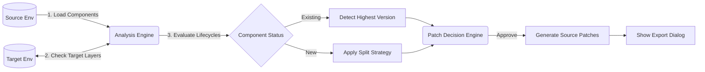

# Solution Deployment Advisor 
### An Intelligent Deployment Engine for Microsoft Dataverse

````carousel
<!-- slide -->
# 1. Executive Summary

> [!TIP]
> **Mission**
> To eliminate deployment guesswork by providing a deterministic, analytics-driven approach to Dataverse solution migrations.

**Solution Deployment Advisor** is an advanced XrmToolBox plugin developed by Osama Mahmoud. It transforms the often risky, manual process of migrating Dataverse components into an automated, transparent, and conflict-free workflow.

**Key Value Propositions:**
* **Pre-Deployment Insight:** Detects target-environment collisions before you ever export a ZIP file.
* **Intelligent Versioning:** Automatically calculates and enforces semantic versioning, preventing Dataverse API errors.
* **Automated Patching:** Slices massive solutions into bite-sized, categorized patches (e.g., Processes vs. Customizations).

<!-- slide -->
# 2. System Architecture

The tool connects simultaneously to your **Source** (Dev) and **Target** (UAT/Prod) environments, cross-referencing components at the layer level.



<!-- slide -->
# 3. The Main Interface 

The main dashboard is your command center. Here is exactly what each control does:

### Connection & Setup
* **`Connect Source / Target`**: Standard XrmToolBox connection buttons. The tool requires dual connections to perform full diffing.
* **`Source Solution Dropdown`**: The unmanaged solution in your Dev environment containing the changes you wish to deploy. 
  *(Publishers and Target Solutions are automatically inferred to streamline the workflow and scan the entire target environment globally).*

### Analysis & Grouping
* **`Split Strategy Dropdown`**: 
  * *None*: Keeps components in a single bucket.
  * *Customization vs Process*: Automatically separates workflows/plugins from tables/forms to prevent lock-in.
  * *By Category*: Groups by UI, Data, Logic, etc.
* **`Analyze Button`**: Triggers the `AnalysisEngine` to pull all components, resolve human-readable names, and query target layers.

<!-- slide -->
# 4. The Component Grid

After analysis, the main grid populates with deep intelligence about your payload:

> [!IMPORTANT]
> The grid color-codes **Risk Levels** (Red = High Risk like Data, Green = Low Risk like UI) to warn you about destructive deployments.

* **Component Type & Name**: Human-readable names (e.g., *Account Table*, *Send Email Flow*), automatically resolved via the `ComponentNameResolver`.
* **Action Column**:
  * `New`: The component does not exist in the Target environment.
  * `Update`: The component exists, and your Source has newer changes.
  * `Unchanged`: The environments are in perfect sync.
* **Target Solution Layers**: Shows exactly which managed/unmanaged layers the component currently lives in on the Target environment.

**Context Menu (Right-Click):**
* **Assign to Solution**: Manually override the automated Split Strategy by forcing selected components into a specific target solution name.
* **Exclude**: Remove risky components from the deployment payload entirely.

<!-- slide -->
# 5. The Patch Decision Engine

When you click **Create Solutions/Patches**, the system evaluates your payload against the Dataverse environment to prevent version collisions.

> [!WARNING]
> Dataverse will reject a patch if its version number already exists or is lower than the highest active layer. 

**The Patch Decision Dialog:**
This intelligent prompt ensures you never hit a version error. It compares your proposed patch against **both** environments:
* **Target Highest Column**: The maximum version currently deployed.
* **Source Highest Column**: The maximum version currently open in dev.
* 🟡 **Yellow Rows**: Indicates an open patch already exists in the Source. You can choose to *Append* to it, or *Create New*.
* 🟠 **Orange Highlights**: Indicates the Source environment was actually *ahead* of the Target. The system automatically bumps your proposed version past the Source to avoid a collision!

<!-- slide -->
# 6. Finalizing Deployment

Once you confirm your patches in the Decision Dialog, the tool executes the changes via the Dataverse API.

* **Creates the Patches**: It provisions empty patches in the Source environment using the calculated semantic versions (e.g., `1.0.0.12`).
* **Moves Components**: It migrates the analyzed components from your base unmanaged solution into these isolated patches.

### Exporting Artifacts
After the patches are successfully generated, a final **Export Dialog** is presented:

* **Review Created Assets**: It provides a clear summary of all the patches and solutions that were just created.
* **`Export CSV`**: Dumps the grid analysis and the list of created patches into an Excel-ready report, perfect for Change Approval Boards (CAB) or deployment documentation.
* **`Export Solutions`**: Allows you to directly trigger the export of the newly minted patches from the source environment, readying them for deployment.
````
